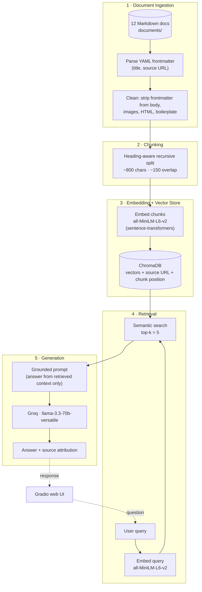

# Project 1 Planning: The Unofficial Guide

> Write this document before you write any pipeline code.
> Your spec and architecture diagram are what you'll use to direct AI tools (Claude, Copilot, etc.) to generate your implementation — the more specific they are, the more useful the generated code will be.
> Update the Retrieval Approach and Chunking Strategy sections if you change your approach during implementation.
> Update this file before starting any stretch features.

---

## Domain

<!-- What domain did you choose? Why is this knowledge valuable and hard to find through official channels? -->

This guide collects real, publicly documented case studies of people who built profitable products and income streams from scratch — and shared their actual revenue numbers. The throughline I care about: many of these founders started with little or no engineering ability (some shipped entirely on no-code tools or AI-written code), yet built products earning thousands to millions per month — which suggests coding skill was never the real bottleneck; ideas, distribution, and persistence over time were. The detail behind that — what they built, what they relied on instead of raw skill, how long it took, and what failed — is scattered across Indie Hackers posts, eBiz Facts roundups, and founder interviews rather than collected anywhere official, so a RAG system over these first-hand accounts lets me ask what actually separated the wins from the failures.

---

## Documents

<!-- List your specific sources: URLs, subreddit names, forum threads, or file descriptions.
     Aim for at least 10 sources that together cover different subtopics or perspectives within your domain. -->

| # | Source | Description | URL or location |
|---|--------|-------------|-----------------|
| 1 | NYT | Medvi — $1.8B AI telehealth middleman run by 2 people | https://www.nytimes.com/2026/04/02/technology/ai-billion-dollar-company-medvi.html |
| 2 | Indie Hackers | Photo AI by Pieter Levels — $0 → $132K MRR in 18 months, solo founder | https://www.indiehackers.com/post/photo-ai-by-pieter-levels-complete-deep-dive-case-study-0-to-132k-mrr-in-18-months-3a9a2b1579 |
| 3 | Indie Hackers | Postiz — open-source social tool, $14.2K MRR as a single developer | https://www.indiehackers.com/post/i-did-it-my-open-source-company-now-makes-14-2k-monthly-as-a-single-developer-f2fec088a4 |
| 4 | OneMillionGoal | Pieter Levels — full indie empire, ~$3.1M/year, no employees | https://www.onemilliongoal.com/p/pieter-levels-the-king-of-indie-hacking |
| 5 | Indie Hackers | 30-app mobile portfolio — $22K/mo solo in under a year | https://www.indiehackers.com/post/tech/from-failed-app-to-30-app-portfolio-making-22k-mo-in-less-than-a-year-myy3U7K9evxGOVOHti8s |
| 6 | eBiz Facts (Goodreads) | FounderPal — no-code AI tool, $60K in 6 months, 2-person team | https://www.goodreads.com/author_blog_posts/24682095-their-no-code-tool-earned-60-000-in-6-months |
| 7 | eBiz Facts (Goodreads) | Mike Cardona — $20K/mo automation consulting ("Automation Alchemist") | https://www.goodreads.com/author_blog_posts/23177017-20k-month-automation-alchemist |
| 8 | nicksaraev.com | Nick Saraev — $100K/mo selling Make.com automations | https://nicksaraev.com/biography/ |
| 9 | Indie Hackers | 2024 year-in-reviews — multiple indie hackers, verified wins & failures | https://www.indiehackers.com/post/lifestyle/earned-1-2m-launched-5-startups-in-2024-indie-hackers-share-their-year-in-reviews-g61Lu08M3otlLESYu9m9 |
| 10 | GladLabs | Contextual: how indie hackers actually make money, real failure rates | https://www.gladlabs.io/posts/beyond-the-bootstrap-how-indie-hackers-actually-ma-f0a313a9 |
| 11 | eBiz Facts (Goodreads) | Roundup A — ~10 short multi-founder income case studies (blog pg 14) | https://www.goodreads.com/author/show/6577180.Niall_Doherty/blog?page=14 |
| 12 | eBiz Facts (Goodreads) | Roundup B — ~10 short multi-founder income case studies (blog pg 45) | https://www.goodreads.com/author/show/6577180.Niall_Doherty/blog?page=45 |

---

## Chunking Strategy

<!-- How will you split documents into chunks?
     State your chunk size (in tokens or characters), overlap size, and explain why those
     numbers fit the structure of your documents.
     A review-heavy corpus warrants different chunking than a long FAQ. -->

**Chunk size:** ~800 characters (~120–150 words), which stays under the all-MiniLM-L6-v2 256-token (~1000 char) truncation limit so no chunk loses content during embedding.

**Overlap:** ~150 characters (roughly 1–2 sentences) to preserve context across paragraph breaks.

**Reasoning:** The corpus is heterogeneous — short single-story posts (~600 words), long multi-section deep-dives (~5,800 words), and two "roundup" pages that each pack ~10 unrelated mini-case-studies. A purely fixed-size split would merge two different founders' numbers into one chunk on the roundup pages, producing confused retrieval. So the splitter breaks on Markdown headings first (`##` / `####`), then paragraphs, then sentences, falling back to character count only when a section exceeds the target size. This isolates each case study while keeping chunks within the embedding model's window. Frontmatter is parsed for metadata (title, source URL) and then stripped from the chunkable body.

---

## Retrieval Approach

<!-- Which embedding model are you using (e.g., all-MiniLM-L6-v2 via sentence-transformers)?
     How many chunks will you retrieve per query (top-k)?
     If you were deploying this for real users and cost wasn't a constraint, what tradeoffs
     would you weigh in choosing a different embedding model — context length, multilingual
     support, accuracy on domain-specific text, latency? -->

**Embedding model:** all-MiniLM-L6-v2 via sentence-transformers — runs locally, no API key or rate limits, 384-dim embeddings, fast on CPU. Good enough for English short-form text.

**Top-k:** 5 — enough context for the LLM to synthesize patterns across multiple case studies (e.g. "which automation tools show up most") without flooding the prompt with low-relevance chunks.

**Production tradeoff reflection:** If I were deploying this for real users and cost weren't a constraint, the tradeoff I'd weigh first is **context length**. MiniLM's 256-token (~1000 char) cap is the single biggest constraint on this system — it forced the small ~800-char chunks and it's the root of the roundup "story-bleed" risk. A long-context embedder (e.g. text-embedding-3-large at 8191 tokens, or Voyage/Cohere) would let a single chunk hold a full case study, which would reduce boundary-splitting and directly help the cross-case questions (Q1, Q2) that need a whole story in one vector. Second, I'd weigh **domain accuracy on numeric/jargon-dense text**: these docs are saturated with "$X MRR" figures and tool names, and a small general-purpose model can map two different founders' revenue passages to nearly identical vectors (right topic, wrong source) — a larger model, or one fine-tuned on this kind of business text, would likely separate them better. Third is **local vs. API**: MiniLM's appeal is that it's local, free, private, and rate-limit-free, but since this corpus is entirely public data, privacy isn't a real concern here, so paying for a hosted API model would be an acceptable trade for the quality gain (the cost being per-query latency and a third-party dependency). **Multilingual support** isn't relevant for this English-only corpus, though it would matter if I expanded to non-English founder stories.

---

## Evaluation Plan

<!-- List your 5 test questions with their expected correct answers.
     Questions should be specific enough that you can judge whether the system's response
     is right or wrong. "What are good dining halls?" is too vague.
     "What do students say about wait times at [dining hall name] during lunch?" is testable. -->

| # | Question | Expected answer |
|---|----------|-----------------|
| 1 | What business models or revenue streams did these founders use to make money? | Recurring SaaS subscriptions / MRR dominate (Photo AI, Postiz, Pieter Levels' portfolio); plus paid communities & courses (Nick Saraev's Skool, $28/mo), done-for-you services & consulting (Mike Cardona, Saraev), one-time digital products (FounderPal, $60K/6mo), ad/sponsor-supported newsletters (the eBiz roundups, e.g. an 85%-margin local newsletter), affiliate, and marketplace/middleman models (Medvi). Recurring revenue is the most common path to scale. |
| 2 | What technical backgrounds did these founders have — did building a profitable product require strong coding skills? | A mix, and that's the point: FounderPal's founders shipped on no-code (Bubble, $32/mo); Josh Mohrer wrote ~99% of Wave AI as a first-time programmer using AI ($450K MRR); others (Pieter Levels, Postiz, the 30-app developer) were capable engineers. Across the corpus, coding ability was not the differentiator between success and failure — ideas, niche focus, distribution, and persistence were. |
| 3 | How long did founders typically take to reach sustainable income? | Wide range. Winners cluster ~6–18 months (FounderPal $60K/6mo; Photo AI $0→$132K MRR in 18mo; 30-app portfolio $22K/mo in under a year; a UGC app $10K in 35 days), but this hides survivorship bias — Pieter Levels spent years and 70+ failed projects first. |
| 4 | What were the biggest failure points or risks across these case studies? | Over-building/scope creep, neglecting marketing/distribution, competitor & platform risk (Photo AI lost users to Lensa for lacking an iOS app), key-person/maintenance risk (Medvi solo op lost ~200 customers; Postiz dev burnout), and market concentration (Nick Saraev's wedding income → $0 at COVID). |
| 5 | How did these founders find their first customers? | Audience/distribution almost always preceded revenue: Hacker News (Photo AI), Reddit/DEV/LinkedIn (Postiz, open-source), Twitter + Product Hunt (FounderPal), Twitter/YouTube/Skool (Nick Saraev — "distribution preceded every revenue spike"), content + cold outreach (Mike Cardona). Counter-example: a local newsletter grew on product alone, no ads or outreach. |

---

## Anticipated Challenges

<!-- What could go wrong? Name at least two specific risks with reasoning.
     Consider: noisy or inconsistent documents, missing source attribution, off-topic
     retrieval, chunks that split key information across boundaries. -->

1. **Roundup "story-bleed" across chunk boundaries.** The two eBiz Facts roundup files each pack ~10 unrelated mini-case-studies. If a chunk spans two of them, retrieval returns merged context and the LLM can attribute one founder's revenue or tactic to another. Mitigation: split on Markdown headings first so each mini-story stays intact (see Chunking Strategy), but this is the corpus's biggest retrieval risk.

2. **Cross-document synthesis failure (esp. Q2).** Questions like "did success require strong coding skills?" require aggregating evidence across many documents and inferring a pattern. RAG retrieves the top-k chunks and the LLM answers from those — it tends to respond literally from whichever single chunk mentions "coding" rather than synthesizing the cross-case conclusion. This is the question I most expect to expose a failure.

3. **Retrieval confusion on numerically/jargon-dense passages.** The docs are saturated with "$X MRR," revenue figures, and tool names. A small general-purpose embedder (all-MiniLM-L6-v2) may map two different founders' "$X MRR" passages to nearly identical vectors, returning the right *topic* from the wrong *source* — a subtle failure that still produces a confident, wrong-sourced answer.

4. **Source attribution is only file-level on roundups.** Citing "eBiz Facts Roundup A" is correct at the document level but not granular to the specific founder inside it, so an attribution can be technically right yet imprecise. Worth flagging honestly rather than overclaiming citation accuracy.

---

## Architecture

<!-- Draw a diagram of your pipeline showing the five stages:
     Document Ingestion → Chunking → Embedding + Vector Store → Retrieval → Generation
     Label each stage with the tool or library you're using.
     You can use ASCII art, a Mermaid diagram, or embed a sketch as an image.
     You'll use this diagram as context when prompting AI tools to implement each stage. -->

---

## AI Tool Plan

<!-- For each part of the pipeline below, describe:
     - Which AI tool you plan to use (Claude, Copilot, ChatGPT, etc.)
     - What you'll give it as input (which sections of this planning.md, which requirements)
     - What you expect it to produce
     - How you'll verify the output matches your spec

     "I'll use AI to help me code" is not a plan.
     "I'll give Claude my Chunking Strategy section and ask it to implement chunk_text()
     with my specified chunk size and overlap" is a plan. -->

AI is for **implementing from the spec above and explaining concepts** — not for making the design decisions (those are already settled in this document) or for judging output. I verify every stage myself by inspecting real chunks and retrieval results.

**Milestone 3 — Ingestion and chunking:** Use AI to generate the loader, the cleaner, and `chunk_text()` from the Documents and Chunking Strategy sections — specifically the heading-first recursive splitter and the frontmatter parser. Verify by printing 5 chunks from a roundup file to confirm no story-bleed.

**Milestone 4 — Embedding and retrieval:** Use AI to scaffold the embedding script (all-MiniLM-L6-v2 → ChromaDB with source URL + chunk position metadata) and a top-k=5 retrieval function, using the Retrieval Approach section and the architecture diagram as context. Verify by running 3 of the eval questions and checking the returned chunks and distance scores.

**Milestone 5 — Generation and interface:** Use AI to write the grounded prompt template, the Groq llama-3.3-70b call, and the Gradio UI. Verify grounding by asking an out-of-scope question and confirming the system refuses instead of inventing an answer.
